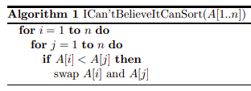

# Clase 2 - 01/10 <!-- omit in toc -->
## Table of Contents <!-- omit in toc -->
- [Grupal](#grupal)
  - [Valores únicos](#valores-únicos)
- [Individual](#individual)
## Grupal
### Valores únicos
Dada una lista de palabras, queremos encontrar el subconjunto resultante de eliminar todas las repetidas. Es decir, buscamos el conjunto de **valores únicos de la lista**. Por ejemplo, en la lista

```r
lista_de_palabras <- c("aca", "hay", "una", "una", "duplicada")
```

hay una palabra duplicada, `"una"`. La salida esperada es `c("aca", "hay", "una", "duplicada")`.

1. Escriba una función que decida si una palabra pertenece a una lista de palabras. Use el siguiente modelo:

```r
buscar_una_palabra <- function(palabra, lista_de_palabras){
    # si_esta_la_palabra = ...  # logical
    return(si_esta_la_palabra)
}
```

2. Si la función buscar_una_palabra hubiera sido correctamente implementada, las siguientes expresiones serían verdaderas:

```r
buscar_una_palabra("hola", list("hola", "chau")) == TRUE
# TRUE
```

```r
buscar_una_palabra("alo", list("hola", "chau")) == FALSE
# TRUE
```

3. Escriba una función que verifique ambas condiciones de manera automática.

```r
test_buscar_una_palabra <- function(){
    # pasa_los_test = ... # logical
    return(pasa_los_test)
}
```
    Cada vez que modifiquemos nuestra función original, tenemos una forma rápida de verificar que aún funciona.

4. Use la función anterior para determinar el vector de elementos únicos de una lista de palabras. Use el siguiente modelo como base:

```r
borrar_duplicados <- function(lista_de_palabras){
    # unicos = ...  # vector
    return(unicos)
}
```

5. En `R` disponemos del comando `unique`. Comparemos los desempeños comparando sus tiempos de ejecución. Usaremos el comando benchmark del paquete `rbenchmark`.

```r
# Instalamos el paquete
install.packages("rbenchmark")

# Cargamos el paquete
library("rbenchmark")

# Generamos una lista de la palabras para testear
lista_test <- generar_lista(letters[1:10], sample(2:5, 10, replace = TRUE))

# Comparamos los tiempos
benchmark(borrar_duplicados(lista_test), unique(lista_test))
```

6. Modifique la función anterior para contar la cantidad de elementos de cada elemento único. Es decir, calcule la **frecuencia absoluta** de los elementos únicos encontrados.

```r
contar_palabras <- function(lista_de_palabras){
    # unicos = ... # vector character
    # aparece = ... # vector integer
    return(lista(unicos = ..., aparece = ...)
}
```

7. Compare el desempeño contra la función `table` de R.

8. Agregue a la función anterior un argumento `frec_tipo` para calcular la **frecuencia relativa** o la **frecuencia porcentual**.

```r
contar_palabras <- function(lista_de_palabras, frec_tipo){
    # unicos = ... # vector character
    # aparece = ... # vector integer
    return(lista(unicos = ..., aparece = ...)
}
```

9. Haga un gráfico de barras con las frecuencias obtenidas de la función anterior. En función del tipo de frecuencia elegido el gráfico deberá ajustar su título y etiquetas en los ejes.

```r
plot_frecuencias = function(frecuencias, etiquetas, frec_tipo){
    # ...
}
```

10. Agregue un argumento para graficar las `N` palabras con más apariciones. Pruebe la función con la salida del siguiente código que usa herramientas para manipular cadenas de texto de la librería `stringr`.

```r
install.packages("stringr)
library(stringr)
```

```r
url = "https://www.gutenberg.org/files/14765/14765-8.txt"
file = readLines(url(url))
file_clean = unlist(strsplit(str_replace_all(file, "([,.0-9])", "")," "))
file_clean
```

11. ¿Qué hace el siguiente código?

```r
all(unique(file_clean) == borrar_duplicados(file_clean))
```

## Individual
1. Escriba una función que sume los primeros `n` números naturales. Compare su desempeño contra la `sum(1:n)`. Utilice el siguiente modelo como base:
    ```r
    sumar_naturales = function(n) {
    # suma = ...
    return(suma)
    }
    ```
2. Escriba una función tal que dada una matriz devuelva su parte triangular superior. Utilice el siguiente modelo como base:
    ```r
    extraer_trisup = function(matriz) {
    # trisup = ...
    return(trisup)
    }
    ```
3. Un juego consiste en revelar una por una las cartas de un mazo mientras que se repiten los números `1, 2 y 3`. Si al revelar la carta coincide con el número cantado, el juego se pierde. Solo se gana si no hay ninguna coincidencia.

   1. Escriba una función que realice una sola repetición del juego. Utilice el siguiente modelo como base:
   ```r
    juego_123 = function() {
    # ganamos = ... # logical
    return(ganamos)
    }
    ```
   2. Luego, juegue `1000` veces y calcule la proporción de veces que ganó el juego. Utilice bucles y compare el desempeño contra el siguiente código:
    ```r
    mean(replicate(n=1000, expr=juego_123))
    ```
4. Diseñe una función que dado un vector numérico devuelva un vector que indique como texto, a qué decil pertenece cada valor. Por ejemplo, para el vector num_vec=1:10, la función debería devolver el vector
    ```r
    c("primer decil", "segundo decil", …, "décimo decil")
    ```

    Utilice el siguiente modelo como base:

    ```r
    indicar_deciles = function(num_vec) {
    # deciles_vec = ...
    return(deciles_vec)
    }
    ```
5. Arme una función que, dado un vector de valores `logical`, indique si son todos `TRUE`. Compare su desempeño contra la función `all`.

6. En la primera página de [este](https://arxiv.org/pdf/2110.01111.pdf) trabajo, sus autores proponen un método para ordenar una lista de números de forma creciente. Escriba una función en R que implemente el pseudocódigo de la imagen. ¿Funciona el método propuesto? Compare su desempeño contra la función `sort`.

